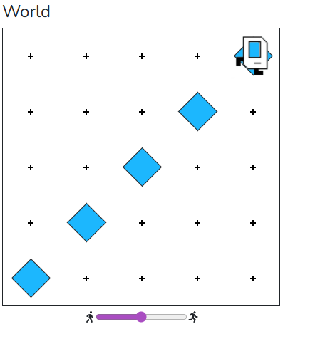

# Assisgnment

 A warmup example. Makes karel place a diagonal, beeper line. Recall how while loops work, and practice stepping up! We are going to use a 
 similar sequence of commands a few times today.

 