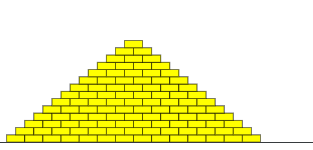

# Assignment

Write a program that draws a pyramid consisting of bricks arranged in horizontal rows, so that the number of bricks in each row decreases by one as you move up the pyramid. A sample run is shown below.




The pyramid should be centered at the bottom of the drawing canvas and should use constants for the following values:


BRICK_WIDTH The width of each brick (30 pixels) 

BRICK_HEIGHT The height of each brick (12 pixels) 

BRICKS_IN_BASE The number of bricks in the base (14)


Note: If you're using a screen reader, you may want to start with a smaller pyramid (smaller BRICKS_IN_BASE) for easier debugging.


You should write your program so that, if the constant values were different, the pyramid drawn would reflect the values in those constants (i.e., brick sizes or the number of bricks in the base could be different).


The bricks can be any color you like. Here is an example of drawing a single yellow brick in the top left corner of the canvas:

```python
canvas.create_rectangle(
    0, 0, 
    BRICK_WIDTH, BRICK_HEIGHT, 
    "yellow", "black"
)
```