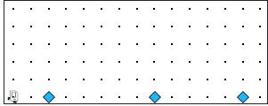
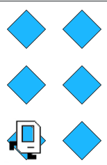

# Assignment
Your country is prototyping hospital-building robots. They have decided to enlist Karel robots. Your job is to program those robots.

Karel begins at the left end of a row that might look like this:

Each beeper in the figure represents a pile of supplies. Karel’s job is to walk along the row and build a new hospital in the places marked by each beeper. Each hospital should be two columns of three beepers, like this:

The new hospital should have their corner at the point at which the pile of supplies was left. At the end of the run, Karel should be at the end of the row having created a set of hospitals. For the initial conditions shown, the result would look like this:

Keep in mind the following information about the world:

- Karel starts facing east at (1, 1) with an infinite number of beepers in its beeper bag.
- The beepers indicating the positions at which hospitals should be built will be spaced so that there is room to build the hospitals without overlapping or hitting walls.
- There will be no supplies left on the last column.
- Karel should not run into a wall if it builds a hospital that extends into that final corner.

Write a program to implement the Hospital Building Karel project. Remember that your program should work for any world that meets the above conditions.