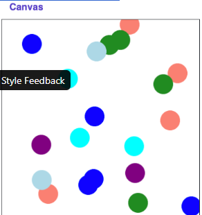

# Assignment

Section 5: Graphics
In this section, our goal is to work on a graphics problem together.

# Problem: Random Circles
Write a program that draws a 20 circles at random positions with random colors on the canvas. You are provided with the constants N_CIRCLES (the number of circles to draw), CANVAS_WIDTH and CANVAS_HEIGHT (the width and height of the canvas, respectively) and CIRCLE_SIZE (the width and height of each circle respectively). Specifically, your job is to implement the following function:

```python
def draw_random_circle(canvas):
```

which takes as a parameter the canvas that will be used to draw all of the random circles. In order to choose a random color, we have a defined a function for you to use called random_color(). It will return a random color that you can use for a given circle. 

```python
def random_color():
    colors = ['blue', 'purple', 'salmon', 'lightblue', 'cyan', 'forestgreen']
    return random.choice(colors)

```




Making all the necessary calls to your draw_random_circle(...) function should produce something that looks like this (of course with randomness yours will have the circles in different locations:)