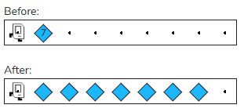

# Assignment
In this task Karel starts by standing in front of a pile of beepers that Karel needs to spread out along the row. Here is an example before and after.

You may assume that:

- There is only one row in the world
- Karel starts with infinite beepers in her bag
- The pile of beepers is on the second corner, directly in front of where Karel starts

The world is wide enough for all the beepers, with at least one free space at the end

Write the code to implement Spread Beepers Karel. Come up with a strategy first. Think, "what are the high-level steps Karel needs to take?" and make these steps into helper functions. Remember that your program should work for a pile of any size. 

(If you have time)

You've spread one row of beepers, now let's write a program that can spread multiple rows!

You can find the extension problem in the handout.